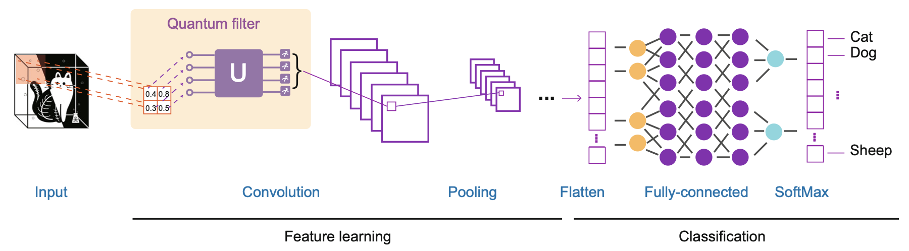

# NCCU Quantum Hackathon

## Introduction
Welcome to the Classical-Quantum CNN Hybrid Model with modified ! 

### The Model Overview
The model flow is as below. With four qubits, we start our Quantum filter. First, we use **angle encoding(RZ, RY)** to transform data into quantum state. And then we use **one-to-one stabilizer** to reduce the error flip bits. After the quantum layer, an 2-d array will be sent into our traditional CNN model to train.

### Key Features:
- **Quantum Filter**: Quantum noise is rising from the indeterminate state, our model is expected to reduce this noise. 
- **QCCNN model**: We implement the CQ 
- **Hybrid Integration**: Seamlessly integrates quantum computations with classical processes.

### Hardware Requirements:
  - Colab with T4 GPU
### Package Requirements:
  - sklearn
  - torch
  - pennylane
  - os
  - other basic packages

### Reference
  - [QCCNN](https://link.springer.com/article/10.1007/s11433-021-1734-3)